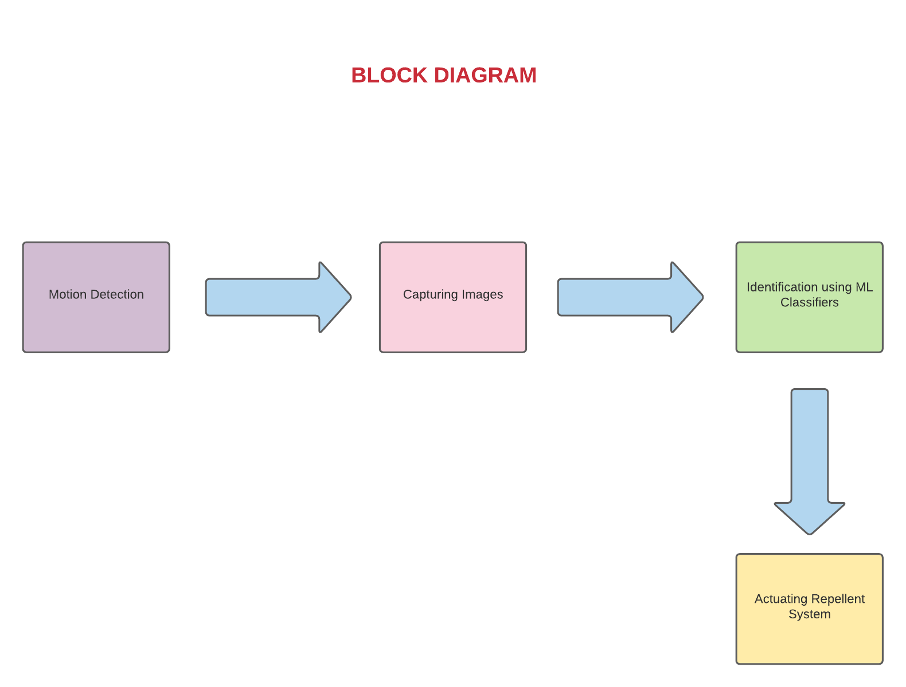

# Agriprotec Systems

## Abstract
Time since there existed the problem of wild animals entering and destroying crops in farmlands adjoining forests in Kerala.As per the field survey conducted by  Kerala Forest
Department(http://docs.kfri.res.in/KFRI-RR/KFRI-RR169.pdf), the main animals involved in crop damage were elephant (Elephas maximus ), gaur (Bos gaurus), sambar (Cervus unicolor), wild boar (Sus scrofa ), bonnet macaque (Macaca radiata), common langur (Presbytis entellus).Among these,elephant and wild boar causes maximum damage.Conventional system of electrified wire fences is not an efficient method as it harms non-targeted species.

As per the research conducted by Lucy King, a graduate student from the University of Oxford confirmed the existance of elephantine phobia towards sounds of angry buzzing bees.
(https://www.nationalgeographic.com/science/article/buzzing-bees-scare-elephants-away).

As a solution to this problem,Agriprotec has made a system that tracks,identifies and takes apt defence against the targeted threat only.In this method we implant PIR sensors + camera combo running completely on solar power.When it detects motion of any animal, it tiggers the microcontroller and activates it  from sleep mode and  the  camera system which captures images from the currently active sensor area and forwards it to a nearby Master system.It then  processes the image and identifies if it is an elephant or boar.If it is an elephant then the system activates the siren which produces buzzing sound and if it's a wild boar then system activates the drumming sound.By this kind of system we are able to save cost and electric energy compared to electrified fences.

## Research Question 
There has been a constant rise in the number of attacks by wild animals on lands near forest or such other areas. Primarily agricultural land, which happens to be free food for the invaders.Is there a solution to eradicate this situation?

## Basic Flowchart of Agriprotec

## Dataset
1.Kaggle dataset for Elephant detection
 https://www.kaggle.com/shivanandbaragali/elephants
 
2.Wild boar image dataset for detection.
 https://drive.google.com/drive/u/0/folders/1_2t86MNNSBCuI3Fn7pfVxOHBFFTGI4LZ

## Hardware Used
PIR Sensors,ESP32 CAM,Master System,Audio Speakers.

## Working of Agriprotec System
When any animal comes within 10m range of Passive Infra Red(PIR) Sensor,it tiggers the external intrupt of the ESP32 CAM and it wakes from deep sleep mode and it captures and transmits a 10sec video stream over WIFI through HTTP protocol,which then is analised by the Master system and indentifies the animal.

   The Master system uses a deployment of CNN model with accuracy not less than 60% to identify the animal.Based on the animal detected, a repelling mechanism is implemented through a system of speakers which frightens the animals and make them run away.
   

## Establishment of Agriprotec System
The Agriprotec sensors can be placed near the borders of the farmland attached onto a pole of 3m height and are used to detect the presence of animals, mainly elephants and wild boars.Each sensor placed at a distance of 20m apart.Then the Master system is placed near center of farmarea.

## Programming language used
Python 3 is used as the programming language with keras framework using tensorflow backend image recognition.
Arduino C for ESP32.

